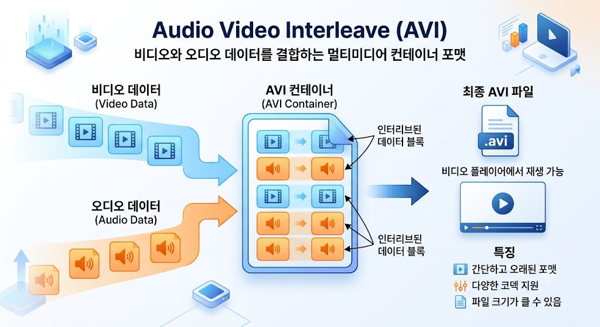

# AVI

## AVI란?

#### **AVI(Audio Video Interleave)는 Microsoft에서 개발한 멀티미디어 파일 포맷이다.**
> 영상과 오디오 데이터를 하나의 파일에 함께 저장할 수 있으며, 다양한 코덱(Codec)을 사용하여 동영상을 저장할 수 있다.
> 확장자는 `.avi`를 사용한다.

---

---

## AVI의 특징
- 영상과 오디오 데이터를 하나의 파일에 함께 저장할 수 있으며, 다양한 코덱(Codec)을 사용하여 동영상을 저장할 수 있다.
- 다양한 코덱을 지원한다.
- 압축률이 낮은 구형 코덱을 사용할 경우, 원본에 가까운 화질을 유지할 수 있다.
- Windows 운영체제 기반의 PC 환경에서 오래전부터 널리 사용되어 왔다.
- 최신 포맷에 비해 동일 화질 대비 파일 크기(용량)가 큰 편이다.

---

## AVI의 동작 방식
AVI는 영상 데이터와 오디오 데이터를 하나의 파일안에 번갈아(Interleave) 저장한다.

실제 압축방식은 사용된 코덱에 따라 달라지며 동일한 AVI파일이라도 사용하는 코덱에 따라 화질과 용량이 달라질 수 있다.

---

## 👍 AVI의 장점
- 압축률이 낮은 코덱과 결합 시 원본 화질은 손실없이 유지하기 유리하다.
- 오래된 포맷인 만큼 다양한 코덱을 유연하게 사용할 수 있다.
- 전통적인 PC용 미디어 플레이어(재생 프로그램)에서 대부분 지원한다.

---

## 👎 AVI의 단점
- 현대적인 최신 포맷(MP4 등)에 비해 압축 효율이 떨어져 파일 크기가 큰 편이다.
- 구조적 한계로 인해 실시간 스트리밍 서비스에는 적합하지 않다.
- 모바일 기기(스마트폰, 태블릿)나 스마트 TV, 웹 브라우저에서의 자체 호환성은 떨어진다.
- 파일에 사용된 특정 코덱이 PC에 설치 되어있지 않으면 재생되지 않을 수 있다.

---

## AVI의 활용분야
- 레거시(과거) 시스템의 동영상 저장 및 보관
- PC 기반의 영상 편집 및 개인 녹화
- 과거에 출시된 디지털카메라 및 게임 영상 녹화 포맷
- Windows 기반 미디어 환경에서 재생

---

## AVI와 MP4 비교
| 항목 | AVI | MP4 |
| --- | --- | --- |
| 개발사 | Microsoft | ISO/IEC (MPEG) |
| 압축 효율 | 낮음 (용량이 상대적으로 큼) | 높음 (적은 용량으로 고화질 유지) |
| 스트리밍 | 적합하지 않음 | 매우 적합 (HTML5 웹 표준) |
| 호환성 | Windows PC 중심 | 모바일, 웹, TV 등 거의 모든 기기 지원 |

---

## AVI와 MKV 비교

| 항목 | AVI | MKV |
| --- | --- | --- |
| 자막 및 멀티 오디오 | 제한적 (별도 자막 파일 필요) | 우수 (다중 자막, 다국어 오디오 내장 지원) |
| 압축 효율 | 낮음 | 높음 (최신 오픈소스 코덱 수용력 우수) |
| 부가 기능 | 제한적 | 챕터 선택, 메타데이터 등 다양한 기능 지원 |

---

## AVI 사용 예시

- 과거 포맷을 사용하는 영상 편집 프로젝트
- Windows 기반의 게임 플레이 영상 저장
- 레거시 하드웨어(과거 캠코더 등)의 촬영 영상
- Windows PC 중심의 영상 파일 보관

---

## 결론

`AVI는 Microsoft에서 개발한 동영상 파일 포맷으로, 영상과 오디오를 하나의 파일에 저장할 수 있다.`

> 💡 과거 PC 환경에서 원본 화질을 유지하는 용도로 널리 쓰였으나 파일 크기가 크고 모바일/웹 호환성이 떨어져,
> 최근에는 압축 효율과 호환성이 높은 MP4와 MKV 같은 포맷이 더 많이 사용되고 있다.
