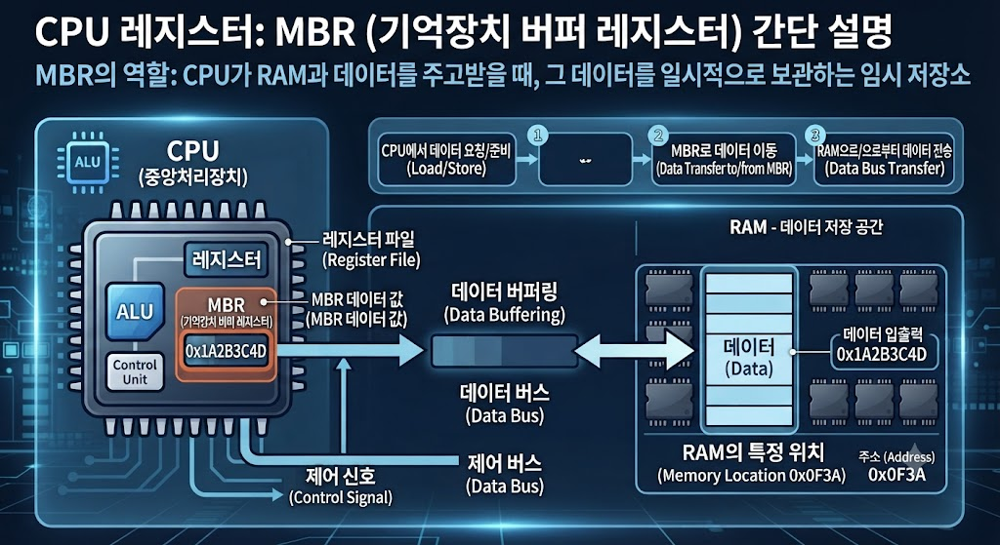

# CPU Register - Memory Buffer Register (MBR)

## Memory Buffer Register(MBR)란?

Memory Buffer Register(MBR)는 CPU Register의 한 종류로, 메모리에서 읽어온 데이터나 메모리에 저장할 데이터를 임시로 저장하는 레지스터이다.

---

---

## Memory Buffer Register의 특징

- CPU Register에 포함된다.
- 메모리와 CPU 사이의 데이터를 임시 저장한다.
- 데이터를 읽거나 쓸 때 사용된다.
- Memory Data Register(MDR)와 같은 의미로 사용되기도 한다.

---

## Memory Buffer Register의 역할

- 메모리 데이터 임시 저장
- 데이터 전송
- 메모리 읽기 및 쓰기 지원

---

## 활용 예시

- 메모리 데이터 읽기
- 메모리 데이터 저장
- CPU와 메모리 간 데이터 전송

---

## 결론

Memory Buffer Register(MBR)는 CPU Register의 한 종류로, 메모리와 CPU 사이에서 데이터를 임시 저장하고 전달하는 역할을 한다.
