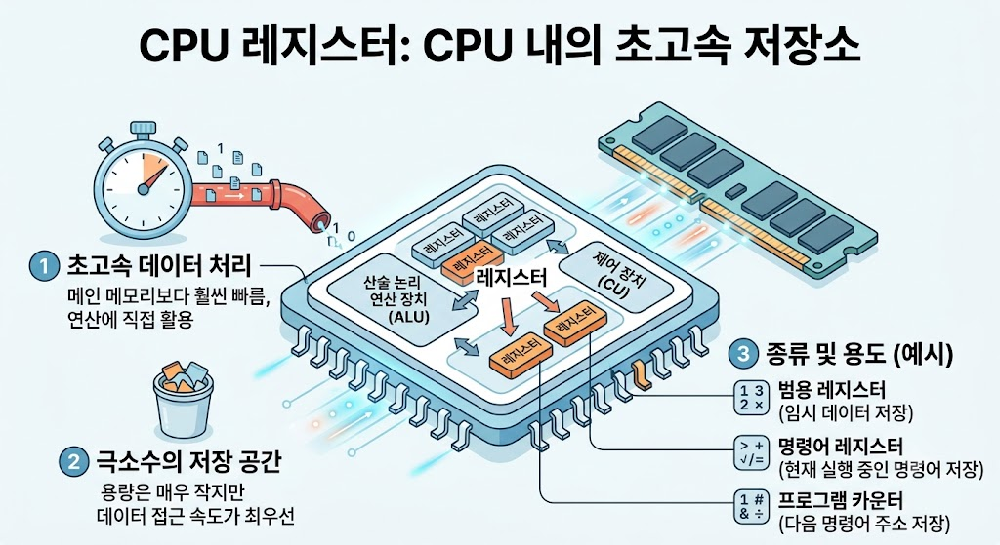

# CPU Register

## CPU Register란?

CPU Register는 CPU 내부에 있는 매우 작은 고속 메모리로, 연산에 필요한 데이터와 주소를 임시로 저장하는 공간이다.

CPU는 Register를 이용하여 빠르게 데이터를 처리한다.

---

---

## CPU Register의 특징

- CPU 내부에 위치한다.
- 데이터 처리 속도가 매우 빠르다.
- 연산에 필요한 데이터를 임시 저장한다.
- 저장 공간은 매우 작다.

---

## CPU Register의 역할

- 데이터 저장
- 연산 수행
- 메모리 주소 저장
- 명령어 실행 지원

---

## CPU Register의 종류

- Program Counter (PC)
- Accumulator (ACC)
- Instruction Register (IR)
- Memory Address Register (MAR)
- Memory Data Register (MDR)

---

## 활용 예시

- 덧셈, 뺄셈 등의 연산
- 명령어 실행
- 메모리 주소 관리
- 데이터 임시 저장

---

## 결론

CPU Register는 CPU 내부의 고속 메모리로, 연산과 명령어 실행에 필요한 데이터를 임시 저장하여 CPU가 빠르게 작업을 수행할 수 있도록 한다.
