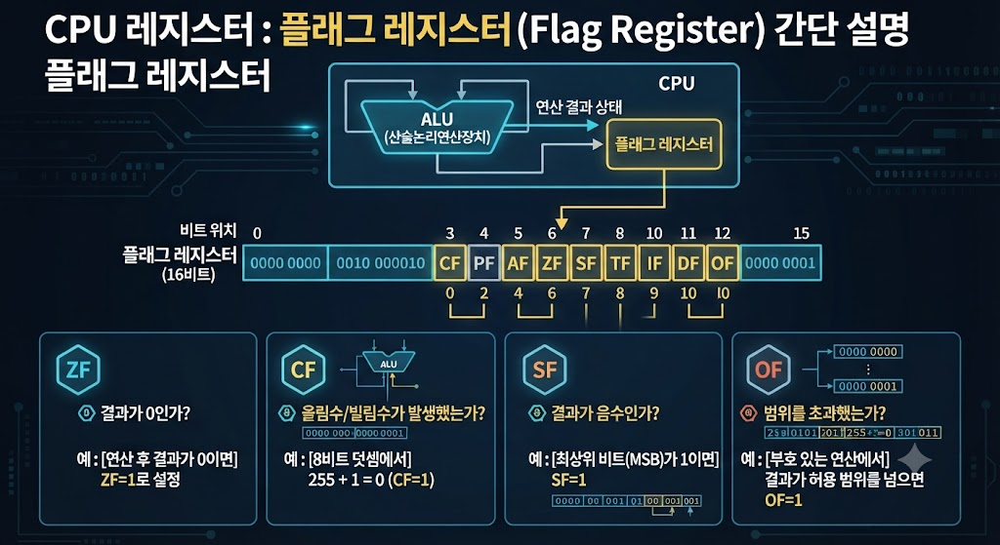

# CPU Register - Flag Register

## Flag Register란?

Flag Register는 CPU Register의 한 종류로, 연산 결과와 CPU의 현재 상태를 저장하는 레지스터이다.

CPU는 Flag Register의 값을 확인하여 조건문이나 분기 명령을 수행한다.

---

---

## Flag Register의 특징

- CPU Register에 포함된다.
- 연산 결과를 저장한다.
- CPU의 상태를 나타낸다.
- 조건 분기에 사용된다.

---

## Flag Register의 역할

- 연산 결과 저장
- CPU 상태 관리
- 조건문 및 분기 명령 지원

---

## 주요 Flag 종류

- Zero Flag (ZF) : 연산 결과가 0인지 확인
- Carry Flag (CF) : 자리올림 발생 여부
- Sign Flag (SF) : 결과의 부호 표시
- Overflow Flag (OF) : 오버플로우 발생 여부

---

## 활용 예시

- 조건문(if)
- 반복문
- 비교 연산
- 산술 연산

---

## 결론

Flag Register는 CPU Register의 한 종류로, 연산 결과와 CPU의 상태를 저장하며 조건문, 반복문, 분기 명령 등을 수행하는 데 사용된다.
