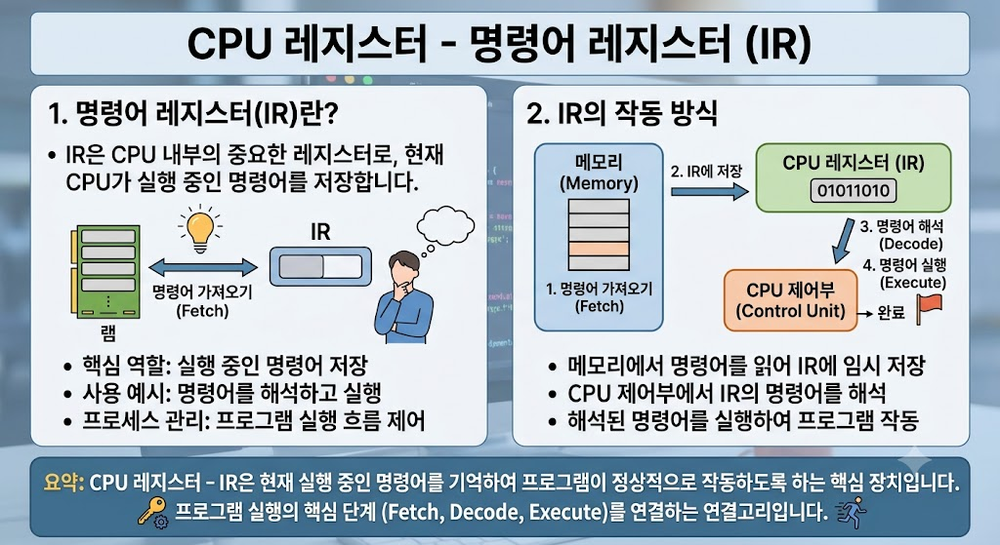

# CPU Register - Instruction Register (IR)

## Instruction Register(IR)란?

Instruction Register(IR)는 CPU Register의 한 종류로, 현재 실행 중인 명령어를 저장하는 레지스터이다.

> CPU는 IR에 저장된 명령어를 해석하고 실행한다.

---

---

## Instruction Register의 특징

- CPU Register에 포함된다.
- 현재 실행 중인 명령어를 저장한다.
- 명령어를 해석하고 실행하는 데 사용된다.
- 명령어가 변경될 때마다 값이 갱신된다.

---

## Instruction Register의 역할

- 현재 명령어 저장
- 명령어 해석
- 명령어 실행 지원

---

## 활용 예시

- 프로그램 실행
- 산술 연산
- 조건문 실행
- 반복문 실행

---

## 결론

Instruction Register(IR)는 CPU Register의 한 종류로, 현재 실행 중인 명령어를 저장하여 CPU가 명령어를 해석하고 실행할 수 있도록 하는 역할을 한다.
