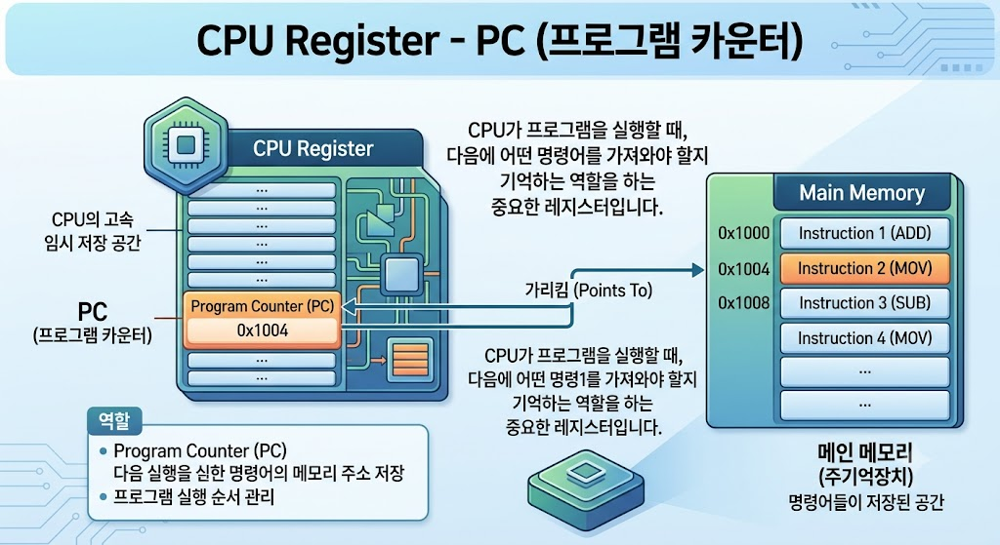

# CPU Register - Program Counter (PC)

## Program Counter(PC)란?

Program Counter(PC)는 CPU Register의 한 종류로, 다음에 실행할 명령어의 메모리 주소를 저장하는 레지스터이다.

CPU는 PC를 참조하여 프로그램을 순서대로 실행한다.

---

---

## Program Counter의 특징

- 다음에 실행할 명령어의 주소를 저장한다.
- CPU Register에 포함된다.
- 명령어가 실행될 때마다 값이 변경된다.
- 프로그램의 실행 순서를 관리한다.

---

## Program Counter의 역할

- 다음 명령어 위치 저장
- 프로그램 실행 순서 관리
- 명령어 실행 지원

---

## 활용 예시

- 프로그램 실행
- 함수 호출
- 반복문 실행
- 조건문 실행

---

## 결론

Program Counter(PC)는 CPU Register의 한 종류로, 다음에 실행할 명령어의 주소를 저장하여 프로그램이 올바른 순서로 실행될 수 있도록 하는 역할을 한다.
