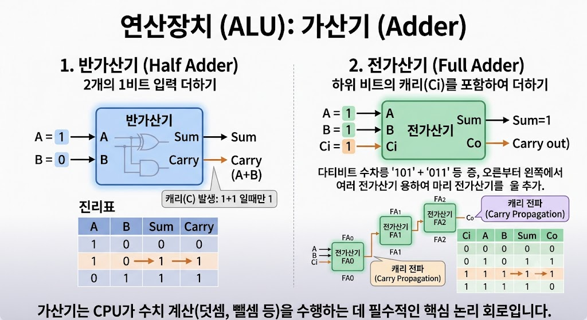

# CPU 연산장치 - 가산기 (Adder)

## 가산기(Adder)란?

가산기(Adder)는 CPU의 연산장치(ALU)에 포함된 회로로, 두 개 이상의 이진수를 더하는 역할을 수행한다.

---

---

## 가산기의 특징

- CPU 연산장치(ALU)에 포함된다.
- 이진수 덧셈을 수행한다.
- 산술 연산의 기본 회로이다.
- 다양한 연산의 기초가 된다.

---

## 가산기의 역할

- 이진수 덧셈
- 산술 연산 수행
- 연산 결과 생성
- CPU 계산 지원

---

## 활용 예시

- 덧셈 연산
- 뺄셈 연산(2의 보수 이용)
- 주소 계산
- 데이터 연산

---

## 결론

가산기(Adder)는 CPU의 연산장치(ALU)에 포함된 회로로, 이진수 덧셈을 수행하여 다양한 산술 연산의 기본 역할을 담당한다.
