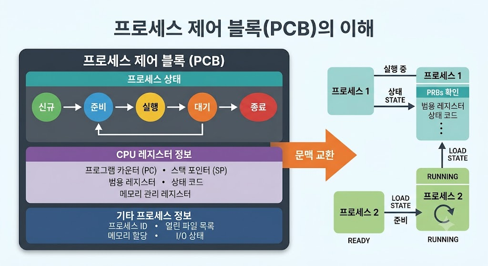

# PCB (Process Control Block)

## PCB란?

PCB(Process Control Block)는 운영체제가 프로세스를 관리하기 위해 사용하는 커널 공간의 자료구조이다.

프로세스의 상태와 실행 정보를 저장하여 CPU가 프로세스를 관리하고, 한 프로세스에서 다른 프로세스로 제어권을 넘겨주는 문맥 교환(Context Switching)이 가능하도록 한다.

---

---

## PCB의 특징

* 프로세스의 핵심 실행 정보를 저장한다.
* 커널 공간에서 운영체제에 의해 직접 관리된다.
* 프로세스가 생성될 때마다 고유하게 하나씩 생성되며, 종료 시 소멸한다.
* 문맥 교환(Context Switching) 시 기존 프로세스의 상태를 백업하고 복구하는 기준이 된다.

---

## PCB에 저장되는 정보

* 프로세스 식별자(PID, Process ID)
* 프로세스 상태(생성, 준비, 수행, 대기, 종료 등)
* 프로그램 카운터(PC, 다음 실행할 명령어의 주소)
* CPU 레지스터 정보(가상 메모리 주소, 누산기 등)
* 메모리 관리 정보(페이지 테이블, 세그먼트 테이블 정보 등)
* CPU 스케줄링 정보(프로세스 우선순위, 스케줄링 큐 포인터 등)
* 입출력 상태 정보(프로세스에 할당된 입출력 장치 및 열린 파일 목록)

---

## PCB의 역할

* 프로세스 상태 관리 및 추적
* 문맥 교환(Context Switching)의 핵심 매개체 역할
* 프로세스 우선순위에 따른 CPU 스케줄링 지원

---

## 결론

PCB(Process Control Block)는 운영체제가 프로세스를 효율적으로 관리하기 위해 사용하는 필수적인 자료구조로, 프로세스의 실행 정보를 저장하고 제어하는 역할을 한다. 시각적인 이해를 돕기 위해 요청하신 PCB 구조와 문맥 교환의 흐름을 담은 개념도를 함께 첨부합니다.