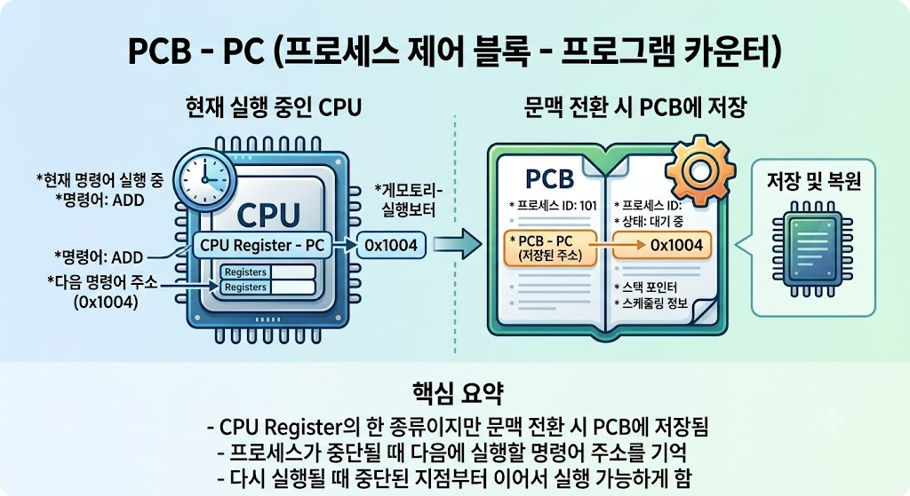

# PCB - Program Counter (PC)

## Program Counter(PC)란?

Program Counter(PC)는 PCB(Process Control Block)에 저장되는 정보 중 하나로, 프로세스가 다음에 실행할 명령어의 메모리 주소를 저장하는 레지스터이다.

---

---

## Program Counter의 특징

- PCB에 저장된다.
- 다음에 실행할 명령어의 주소를 저장한다.
- 프로세스 전환(Context Switching) 시 저장된다.
- 프로그램 실행 순서를 관리한다.

---

## Program Counter의 역할

- 다음 명령어 위치 저장
- 프로세스 실행 재개
- 프로그램 실행 순서 관리

---

## 활용 예시

- 프로세스 실행
- Context Switching
- CPU 스케줄링

---

## 결론

Program Counter(PC)는 PCB에 저장되는 정보로, 다음에 실행할 명령어의 주소를 저장하여 프로세스가 중단된 위치에서 다시 실행될 수 있도록 한다.
