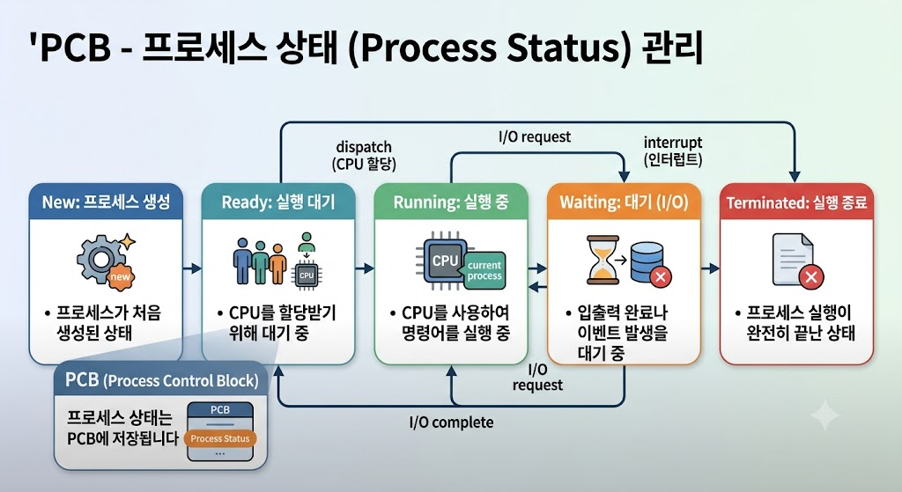

# PCB - Process Status

## Process Status란?

Process Status는 PCB(Process Control Block)에 저장되는 정보 중 하나로, 현재 프로세스의 실행 상태를 나타낸다.

운영체제는 Process Status를 통해 프로세스의 현재 상태를 관리한다.

---

## Process Status의 특징

- PCB에 저장된다.
- 프로세스의 현재 상태를 나타낸다.
- 운영체제가 상태를 관리한다.
- 상태는 실행 중 변경될 수 있다.

---

## Process Status의 종류

- New : 프로세스 생성
- Ready : 실행 대기
- Running : 실행 중
- Waiting : 입출력 등 이벤트 대기
- Terminated : 실행 종료

---

---

## Process Status의 역할

- 프로세스 상태 관리
- CPU 스케줄링
- 프로세스 실행 제어

---

## 결론

Process Status는 PCB에 저장되는 정보로, 프로세스의 현재 실행 상태를 나타내며 운영체제가 프로세스를 관리하는 데 사용된다.