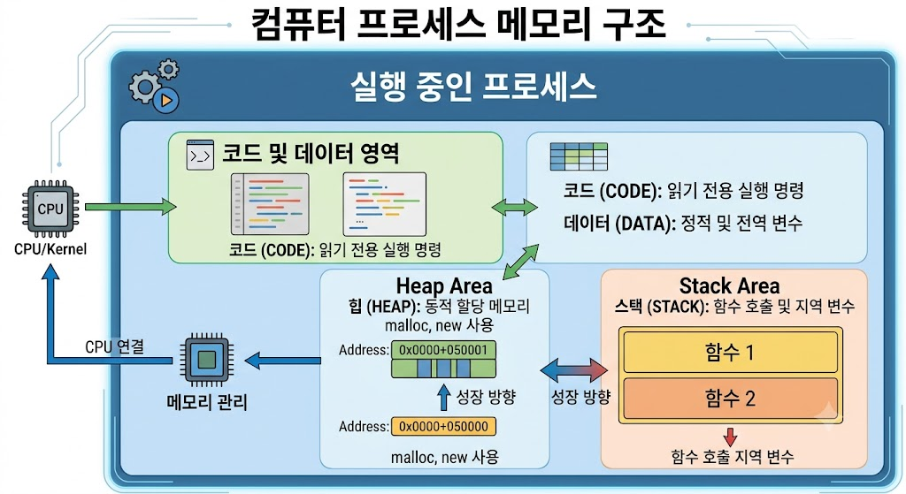

# Process

## 프로세스(Process)란?

프로세스(Process)는 실행 중인 프로그램을 의미한다.

프로그램이 디스크에 저장된 상태라면, 프로세스는 메모리에 올라와 CPU의 자원을 할당받아 실제로 실행되고 있는 상태를 말한다.

예를 들어 메모장이나 웹 브라우저를 실행하면 각각 하나의 프로세스가 생성된다.

---

---

## 프로세스의 특징

- 운영체제로부터 자원을 할당받는다.
- 독립적인 메모리 공간을 가진다.
- CPU를 사용하여 작업을 수행한다.
- 여러 프로세스가 동시에 실행될 수 있다.

---

## 프로세스의 구성 요소

### Code 영역

프로그램의 실행 코드가 저장되는 영역이다.

### Data 영역

전역 변수와 정적 변수가 저장되는 영역이다.

### Heap 영역

동적으로 생성된 데이터가 저장되는 영역이다.

### Stack 영역

함수 호출과 지역 변수가 저장되는 영역이다.

---

## 프로세스의 상태

### 생성(New)

프로세스가 생성되는 단계이다.

### 준비(Ready)

CPU를 할당받기 위해 대기하는 상태이다.

### 실행(Running)

CPU를 할당받아 실행 중인 상태이다.

### 대기(Waiting)

입출력 작업 등을 기다리는 상태이다.

### 종료(Terminated)

프로세스의 실행이 끝난 상태이다.

---

## 프로세스의 특징

- 각각 독립적인 메모리 공간을 가진다.
- 다른 프로세스와 메모리를 공유하지 않는다.
- 운영체제가 프로세스를 관리한다.
- 하나의 프로그램에서 여러 프로세스를 생성할 수 있다.

---

## 프로세스와 프로그램의 차이

| 항목 | 프로그램 | 프로세스 |
|------|----------|---------|
| 상태 | 저장된 파일 | 실행 중인 상태 |
| 위치 | 디스크 | 메모리 |
| 실행 여부 | 실행되지 않음 | 실행 중 |
| 자원 사용 | 없음 | CPU와 메모리 사용 |

---

## 프로세스의 장점

- 안정성이 높다.
- 메모리 충돌이 적다.
- 독립적으로 실행된다.
- 하나의 프로세스 오류가 다른 프로세스에 영향을 주지 않는다.

---

## 프로세스의 단점

- 메모리 사용량이 많다.
- 생성 비용이 크다.
- 프로세스 간 통신이 어렵다.
- 문맥 교환(Context Switching) 비용이 발생한다.

---

## 실생활 예시

- 웹 브라우저 실행
- 게임 실행
- 메모장 실행
- 음악 플레이어 실행

예를 들어 Chrome과 게임을 동시에 실행하면 각각 별도의 프로세스로 동작한다.

---

## 결론

프로세스는 실행 중인 프로그램을 의미하며, 운영체제로부터 CPU와 메모리 등의 자원을 할당받아 작업을 수행한다.

현대 운영체제는 여러 프로세스를 동시에 실행하여 멀티태스킹 환경을 제공한다.
