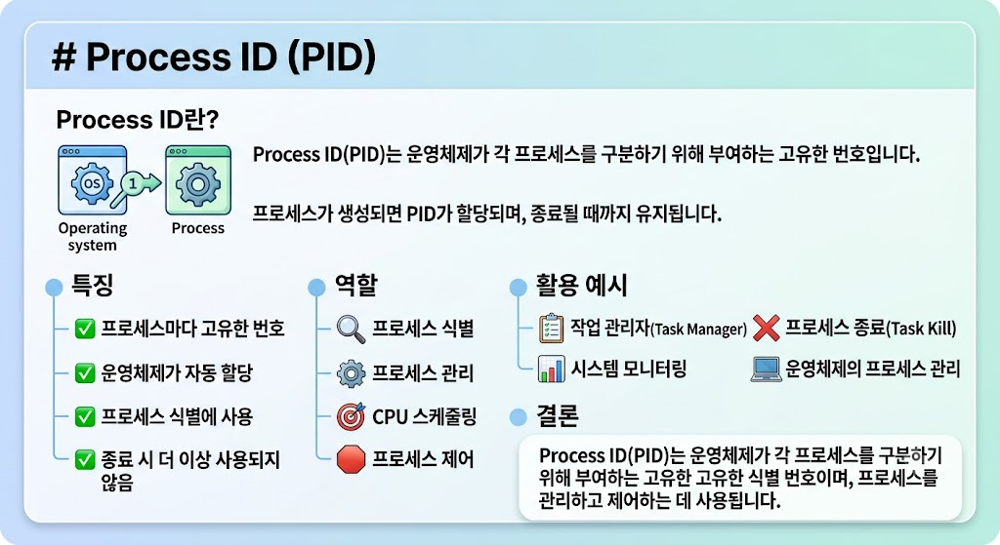

# PCB - Process ID (PID)

## Process ID란?

📢 Process ID(PID)는 PCB(Process Control Block)에 저장되는 정보 중 하나로, 각 프로세스를 구별하기 위해 운영체제가 부여하는 고유한 번호이다.

---

---

## Process ID의 특징

- 프로세스마다 고유한 번호를 가진다.
- 운영체제가 자동으로 할당한다.
- PCB에 저장된다.
- 프로세스를 식별하는 데 사용된다.

---

## Process ID의 역할

- 프로세스 식별
- 프로세스 관리
- 프로세스 제어
- 프로세스 검색

---

## 활용 예시

- 작업 관리자(Task Manager)
- 프로세스 종료(Task Kill)
- 운영체제의 프로세스 관리

---

## 결론

Process ID(PID)는 PCB에 저장되는 고유한 식별 번호로, 운영체제가 각 프로세스를 구분하고 관리하는 데 사용된다.
