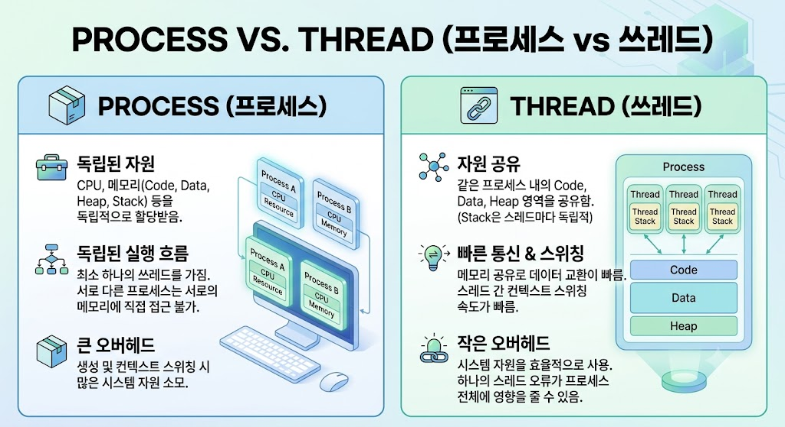

# Process vs Thread

## Process vs Thread란?

> Process는 실행 중인 프로그램이고, Thread는 Process 안에서 실제 작업을 수행하는 실행 단위이다.
>  > 하나의 Process는 하나 이상의 Thread를 가질 수 있다.

---

---

## Process의 특징

- 실행중인 프로그램
- 독립적인 메모리 사용
- 하나 이상의 Thread 포함

---

## Thread의 특징

- Process 내부에서 실행
- 실제 작업 수행
- Process의 메모리 공유

---

## Process와 Thread 비교

| 항목 | Process | Thread |
|------|------|------|
| 의미 | 실행 중인 프로그램 | 실행 단위 |
| 메모리 | 독립적 | 공유 |
| 생성 속도 | 느림 | 빠름 |
| 자원 공유 | 불가능 | 가능 |

---

## 활용 예시

- Process : Chrome, Unity, Visual Studio
- Thread : 게임 렌더링, AI, 다운로드

---

## 결론

Process는 실행 중인 프로그램이고, Thread는 Process 내부에서 작업을 수행하는 실행 단위이다.
