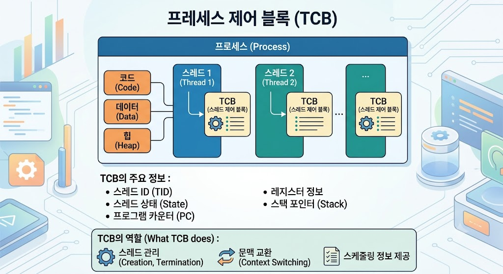

# TCB (Thread Control Block)

## TCB란?

TCB(Thread Control Block)는 운영체제가 스레드를 관리하기 위해 사용하는 자료구조이다.

스레드의 상태와 실행 정보를 저장하여 스레드의 생성, 실행, 종료를 관리한다.

---

---

## TCB의 특징

- 스레드 정보를 저장한다.
- 운영체제가 관리한다.
- 스레드마다 하나씩 생성된다.
- 스레드 전환(Context Switching)에 사용된다.

---

## TCB에 저장되는 정보

- 스레드 ID(TID)
- 스레드 상태
- 프로그램 카운터(PC)
- CPU 레지스터 정보
- 스택(Stack) 정보
- 스케줄링 정보

---

## TCB의 역할

- 스레드 상태 관리
- 스레드 전환(Context Switching)
- CPU 스케줄링 지원

---

## 결론

TCB(Thread Control Block)는 운영체제가 스레드를 관리하기 위해 사용하는 자료구조로, 스레드의 실행 정보를 저장하고 관리하는 역할을 한다.