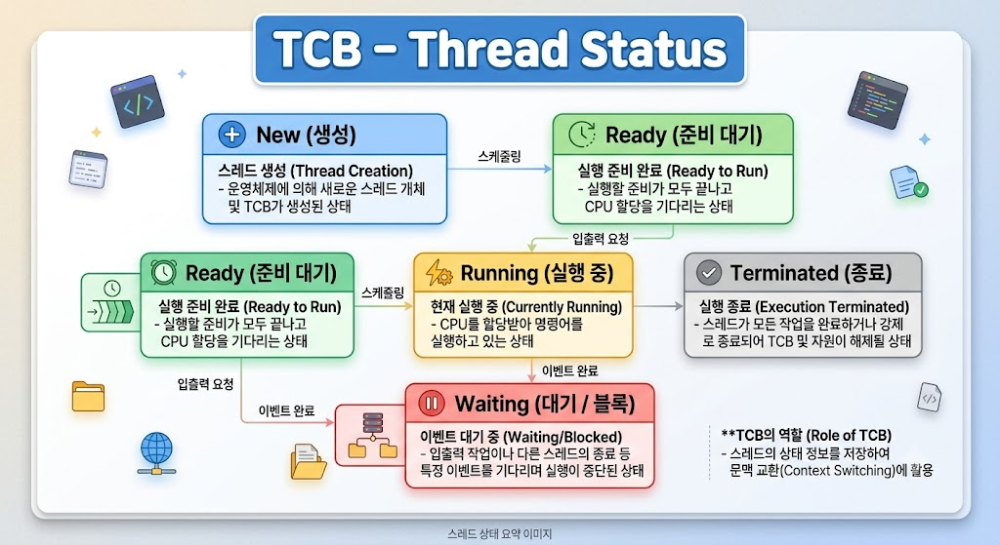

# TCB - Thread Status

## Thread Status란?

Thread Status는 TCB(Thread Control Block)에 저장되는 정보 중 하나로, 현재 스레드의 실행 상태를 나타낸다.

운영체제는 Thread Status를 통해 스레드의 현재 상태를 관리한다.

---

---

## Thread Status의 특징

- TCB에 저장된다.
- 스레드의 현재 상태를 나타낸다.
- 운영체제가 상태를 관리한다.
- 상태는 실행 중 변경될 수 있다.

---

## Thread Status의 종류

- New : 스레드 생성
- Ready : 실행 대기
- Running : 실행 중
- Waiting : 이벤트 또는 자원 대기
- Terminated : 실행 종료

---

## Thread Status의 역할

- 스레드 상태 관리
- CPU 스케줄링
- 스레드 실행 제어

---

## 결론

Thread Status는 TCB에 저장되는 정보로, 스레드의 현재 실행 상태를 나타내며 운영체제가 스레드를 관리하는 데 사용된다.