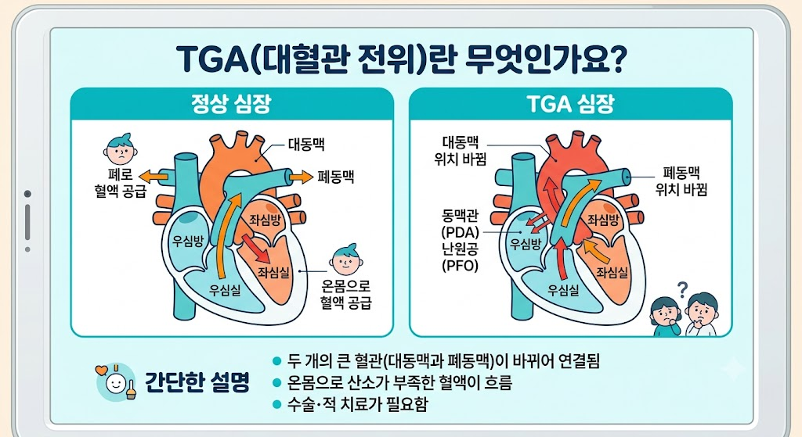

# TGA

## TGA란?

> 📢 TGA(Truevision Graphics Adapter)는 Truevision에서 개발한 래스터 이미지 파일 포맷이다.
> 고품질 이미지를 저장할 수 있으며, 알파 채널(Alpha Channel)을 지원하며 게임 개발과 그래픽 디자인 분야에서 많이 사용된다.
> 확장자는 `.tga`를 사용한다.
---

---

## TGA의 동작 방식

TGA는 이미지의 픽셀 정보를 저장하며, 필요에 따라 RLE(Run-Length Encoding) 방식으로 압축할 수 있다.
또한 알파 채널을 함께 저장하여 투명도 정보를 유지할 수 있다.

---

## TGA의 장점

- 원본에 가까운 화질을 유지한다.
- 알파 채널을 지원한다.
- 이미지 편집에 적합하다.
- 게임 엔진에서 널리 사용된다.

---

## TGA의 단점

- 파일 크기가 큰 편이다.
- JPG나 PNG보다 사용 빈도가 낮다.
- 웹 브라우저에서 기본적으로 지원하지 않는다.

---

## TGA의 활용 분야

- 게임 텍스처
- 3D 모델링
- 그래픽 디자인
- 이미지 편집
- 게임 UI 제작

---

## TGA와 PNG 비교

| 항목 | TGA | PNG |
|------|-----|-----|
| 압축 방식 | 무압축 또는 RLE 압축 | 무손실 압축 |
| 파일 크기 | 비교적 큼 | 비교적 작음 |
| 화질 | 원본 유지 | 원본 유지 |
| 알파 채널 | 지원 | 지원 |
| 사용 용도 | 게임 개발, 그래픽 | 웹, UI, 이미지 공유 |

---

## TGA와 JPG 비교

| 항목 | TGA | JPG |
|------|-----|-----|
| 압축 방식 | 무압축 또는 RLE 압축 | 손실 압축 |
| 화질 | 원본 유지 | 압축 시 화질 손실 |
| 파일 크기 | 큼 | 작음 |
| 알파 채널 | 지원 | 지원하지 않음 |
| 사용 용도 | 게임 개발 | 사진 저장 |

---

## TGA 사용 예시

- 게임 캐릭터 텍스처
- UI 이미지
- 아이콘 제작
- 3D 모델 텍스처
- 그래픽 디자인 작업

---

## 결론

TGA는 고품질 이미지와 알파 채널을 지원하는 이미지 파일 포맷이다.
주로 게임 개발과 그래픽 디자인에서 사용되며, 원본 화질을 유지할 수 있지만 파일 크기가 큰 편이다.
