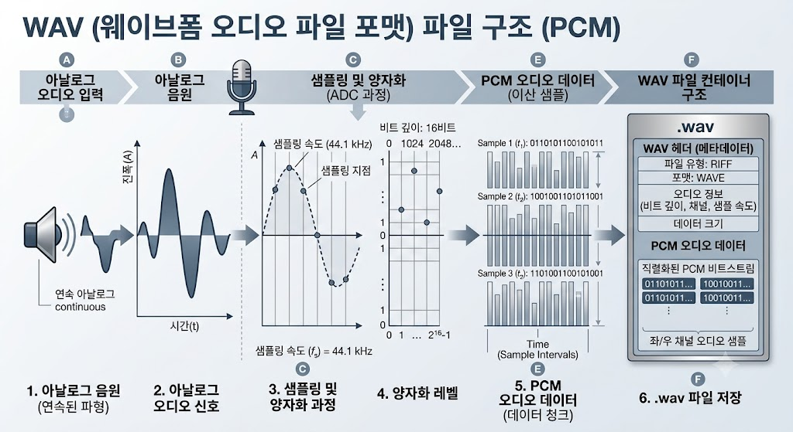

# WAV (Waveform Audio File Format)
# WAV란?
### WAV(Waveform Audio File Format)는 Microsoft와 IBM이 공동으로 개발한 디지털 오디오 파일 포맷입니다.

#### 음성이나 음악을 원본에 가까운 품질로 저장할 수 있으며 일반적으로 압축을 사용하지 않는 비압축 방식으로 기록되며 매우 높은 음질을 제공합니다. 확장자는 `.wav`를 사용합니다.
---

---

## WAV의 주요 특징
* **최고 수준의 음질** 원본 소리를 손실 없이 그대로 유지하므로 오디오 품질이 매우 뛰어납니다.
* **비압축 방식 저장** 압축 과정이 없거나 최소화되어 있어 데이터 변형이 없습니다.
* **대용량 파일** 압축하지 않기 때문에 MP3 등 압축 포맷에 비해 파일 크기가 매우 큽니다.
* **뛰어난 호환성** 윈도우, 맥, 리눅스 등 대부분의 운영체제(OS)와 오디오 프로그램에서 기본적으로 지원합니다.
* **용량 제한(최대 4GB)** 파일 구조상 내부적으로 32비트 정수를 사용하기 때문에 단일 파일의 크기가 최대 **4GB로 제한** 된다는 기술적 한계가 있습니다.

---

## WAV의 동작 방식 (PCM)
WAV는 오디오 데이터를 주로 **PCM(Pulse Code Modulation, 펄스 부호 변조)** 방식으로 저장합니다.

* **PCM 방식이란?** 아날로그 소리 신호를 디지털 0과 1로 변환할 때 소리의 높낮이를 일정한 시간 간격으로 샘플링하여 변형 없이 그대로 기록하는 방식입니다.
* 압축을 전혀 거치지 않기 때문에 CPU 연산 부담이 적어 실시간 편집에 유리하지만, 그만큼 데이터 용량이 크게 증가합니다.

> 💡 **참고: WAV 파일 크기 계산 (CD 음질 기준)**
> CD 음질($44.1\,\text{kHz}$, $16\,\text{bit}$, 스테레오) 기준으로 WAV 파일은 초당 약 $1.4\,\text{Mbps}$의 데이터를 처리합니다. 이를 계산하면 **1분에 약 $10.5\,\text{MB}$**의 용량을 차지하게 됩니다. (3분 곡 기준 약 $31.5\,\text{MB}$)

---

## 장단점 요약

### 😊 장점
1. **무손실 음질** 원본과 다름없는 완벽한 음질을 유지합니다.
2. **오디오 편집 최적화** 압축을 풀고 압축하는 과정이 없기 때문에 컷 편집, 이펙트 적용 등 후반 작업에 가장 적합합니다.
3. **높은 범용성** 거의 모든 재생 장치 및 편집 소프트웨어와 호환됩니다.

### 😣 단점
1. **지나치게 큰 용량** 저장 공간을 많이 차지합니다.
2. **네트워크 전송 비효율성** 파일이 무겁기 때문에 웹 스트리밍이나 인터넷 전송, 이메일 첨부 등에는 부적합합니다.
3. **제한적인 메타데이터** MP3나 FLAC에 비해 앨범 아트, 가사, 상세 태그 정보를 저장하고 관리하는 기능이 제한적입니다.

---

## 핵심 오디오 포맷 비교 (WAV vs FLAC vs MP3)

- 오디오 포맷별 특징을 비교

| 항목 | WAV | FLAC | MP3 |
|:---|:---|:---|:---|
| **압축방식** | 비압축(Raw PCM) | 무손실 압축 | 손실 압축 |
| **용량 비율** | 100%(매우 큼) | 약 50~60% (비교적 작음) | 약 10% (매우 작음) |
| **음질 손실** | 없음 | 없음 | 있음(고주파 대역 등 삭제) |
| **메타데이터** | 제한적 (태그 입력 불편) | 완벽 지원(앨범 아트 등) | 완벽 지원 |
| **주요 용도** | 스튜디오 레코딩, 원본 편집 | 고음질 음원 소장 및 감상 | 스트리밍, 일상적 음악 감상 |

---

## WAV의 활용 분야
* **음악 및 사운드 제작** 스튜디오 녹음(Recording) 및 믹싱/마스터링 단계의 표준 포맷
* **게임 개발** 레이턴시(반응 지연)가 없어야 하는 게임 효과음(SE) 및 캐릭터 음성 데이터
* **영상 편집** 영화, 유튜브, 방송 제작 시 싱크가 밀리지 않도록 사용하는 오디오 싱크 가이드 및 마스터 음원
* **시스템 사운드** 운영체제나 키오스크 등에서 사용되는 경고음 및 알림음

---

## ‼️결론
WAV는 **용량을 대가로 최고의 음질과 작업 효율성을 얻는 오디오 포맷**입니다. 파일크기가 크다는 단점이 있지만 소리의 손실이 없어야 하는 전문 음악 제작, 영상 편집 분야에서는 여전히 대체 불가능한 업계 표준으로 널리 사용되고 있습니다.
